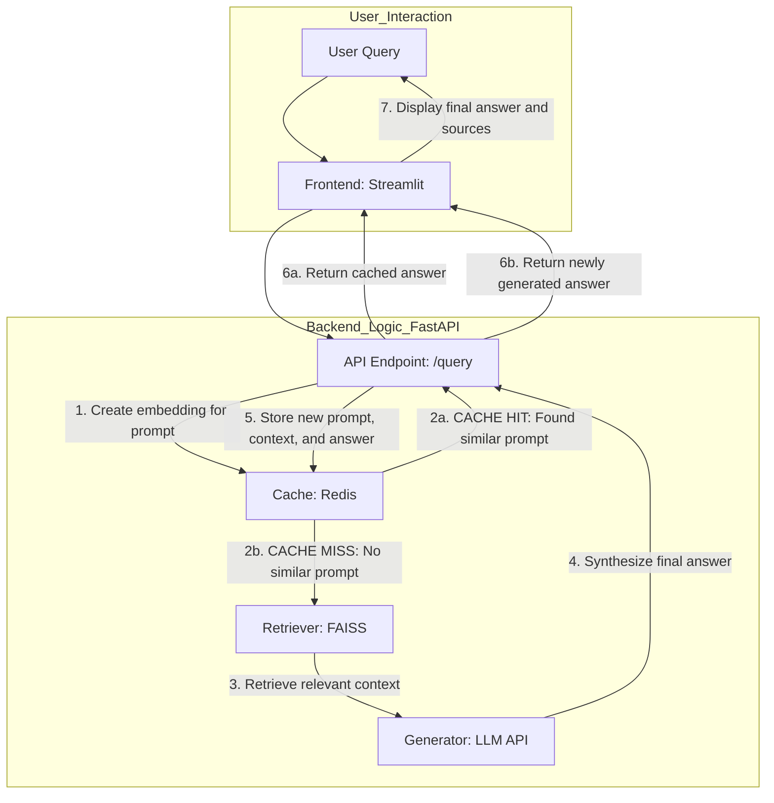
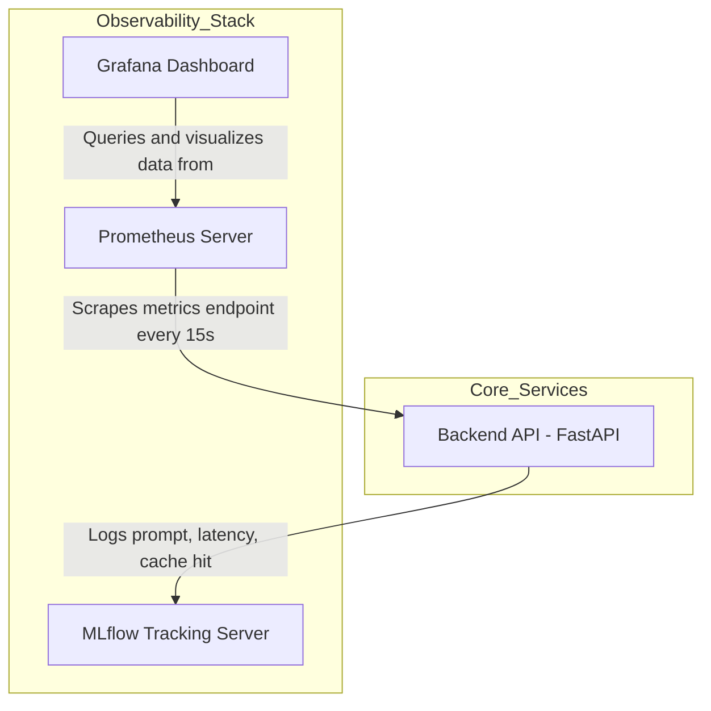

# PromptCache: A Latency-Optimized RAG System

**PromptCache** is a complete, containerized **Retrieval-Augmented Generation (RAG)** system designed to reduce latency and API costs.  
It introduces a **dynamic semantic caching layer** that intercepts user queries, checks for similarity against past prompts, and serves cached responses for similar questions — effectively bypassing redundant retrieval and generation steps.

The project is built using a modern **MLOps stack**, featuring Docker for containerization, DVC for data versioning, MLflow for experiment tracking, and Prometheus/Grafana for real-time monitoring.

---

## 1. Problem Statement

Standard RAG systems perform a full vector database lookup for every incoming query.  
This approach is inefficient and costly, especially when users ask semantically similar or repeated questions.

Each query triggers the same sequence of embedding → retrieval → generation, leading to:
- Higher latency
- Unnecessary compute usage
- Increased API expenses for LLM calls

---

## 2. Solution Overview

**PromptCache** introduces an intelligent caching layer between the user interface and the RAG backend pipeline.

1. **Embedding Generation:**  
   Each query is first transformed into an embedding vector using a SentenceTransformer model (GTE-Large).

2. **Cache Lookup (Redis):**  
   The system checks for previously seen prompts with high cosine similarity.

   - **Cache Hit:** If similarity > 0.95, the cached response is served instantly.
   - **Cache Miss:** If not found, the query proceeds through the RAG pipeline, and the result is cached for future use.

This hybrid caching mechanism can reduce query latency by **over 60%** and significantly lower API costs.

---

## 3. Key Features

| Feature | Description |
|----------|--------------|
| **Full RAG Pipeline** | Processes PDF documents, creates FAISS-based vector indexes, and uses a Large Language Model (Google Gemini) for synthesis. |
| **Semantic Caching** | Uses Redis to cache embeddings and generated responses for similar queries. |
| **Interactive Frontend** | Built with Streamlit for user-friendly query input and visualization. |
| **Real-Time Monitoring** | Prometheus and Grafana dashboards display metrics such as latency, cache hit rate, and system load. |
| **MLOps Integration** | Includes DVC for data management, MLflow for experiment tracking, and Docker Compose for orchestration. |
| **Reproducibility** | Entire system is containerized and deployable with one command. |

---

## 4. System Architecture

The project is composed of two main architectural layers: the **Core Application Flow** for handling user queries, and the **Observability Stack** for monitoring and experiment tracking.

### 1. Core Application Architecture

This diagram illustrates the lifecycle of a single user query, highlighting the semantic caching logic.



### 2. MLOps & Monitoring Architecture

This diagram shows how the observability services run alongside and interact with the backend API to provide insights into the system's performance and behavior.



*   **MLflow Tracking:** On every API call, the FastAPI backend logs key parameters (like the prompt) and metrics (latency, cache hit status) to the **MLflow server**. This is invaluable for tracking experiments and comparing the performance of different models or prompts over time.
*   **Prometheus Monitoring:** The backend exposes a `/metrics` endpoint. The **Prometheus server** periodically "scrapes" this endpoint to collect real-time data on request rates, error counts, and latency distributions.
*   **Grafana Visualization:** **Grafana** connects to Prometheus as a data source, allowing you to build live dashboards to visualize the system's health and performance over time.

This two-part architecture provides a robust, production-ready RAG system that is not only functional but also fully observable.

---

## 5. Technology Stack

| Category             | Technology                                                              |
| -------------------- | ----------------------------------------------------------------------- |
| **Backend**          | FastAPI, Uvicorn, Python 3.9                                            |
| **Frontend**         | Streamlit                                                               |
| **Database & Cache** | Redis                                                                   |
| **Generative AI**    | Google Generative AI (Gemini)                                           |
| **Data Processing**  | PyPDF, SentenceTransformers (thenlper/gte-large), FAISS, NumPy          |
| **MLOps & Tooling**  | Docker, Docker Compose, DVC, MLflow, Prometheus, Grafana, python-dotenv |

---

## 6. Project Structure

The project is organized into distinct modules for clarity and scalability. Key components are containerized for easy deployment.

```
PromptCache/
│
├── .dvc/               # DVC metadata for tracking large files
├── .github/workflows/  # (Optional) CI/CD workflows using GitHub Actions
├── backend/            # Containerized FastAPI application
│   ├── __init__.py     # Makes 'backend' a Python package
│   ├── cache.py        # Semantic caching logic with Redis
│   ├── embedder.py     # Handles text-to-vector embedding
│   ├── generator.py    # Synthesizes answers using the LLM
│   ├── main.py         # FastAPI application entrypoint and API routes
│   ├── retriever.py    # Searches the FAISS index for relevant context
│   ├── Dockerfile      # Instructions to build the backend Docker image
│   └── requirements.txt# Python dependencies for the backend
│
├── data/               # Data artifacts managed by DVC (not committed to Git)
│   ├── book1.pdf       # Example source document
│   ├── book1.json      # Processed text chunks from the PDF
│   ├── documents.json  # Consolidated map of all document chunks
│   ├── faiss_index.bin # The FAISS vector index
│   └── ...             # .dvc pointer files are committed to Git
│
├── frontend/           # Containerized Streamlit application
│   ├── app.py          # The Streamlit web interface code
│   ├── Dockerfile      # Instructions to build the frontend Docker image
│   └── requirements.txt# Python dependencies for the frontend
│
├── .env                # Secret keys (e.g., GOOGLE_API_KEY), ignored by Git
├── .gitignore          # Specifies files and directories for Git to ignore
├── docker-compose.yml  # Defines and orchestrates all services (backend, frontend, redis, etc.)
├── build_index.py      # Script to create the FAISS index from processed data
├── ingest.py           # Script to process source PDFs into structured JSON
└── README.md           # You are here!
```

---

## 7. Getting Started

Follow the steps below to set up and run the complete PromptCache system.

Prerequisites

Git

Python 3.10+

Docker & Docker Compose installed

---

Step 1: Clone the Repository

```bash
git clone https://github.com/your-username/PromptCache.git
cd PromptCache
```

---

Step 2: Set Up the Environment

Create and activate a virtual environment for local data processing:

```bash
python -m venv venv
source venv/bin/activate
pip install -r backend/requirements.txt pypdf
```

---

Step 3: Configure the API Key

PromptCache uses the Google Gemini API for text generation.
Add your API key to .env:

```bash
GOOGLE_API_KEY="YOUR_API_KEY_HERE"
```

---

Step 4: Build the Knowledge Base

Place all your source PDFs into the data/ directory.

Process and index them using the scripts provided:

```bash
python ingest.py         # Extract and chunk text
python build_index.py    # Create FAISS index
```

---

Step 5: Launch the Application

Start all services using Docker Compose:

```bash
docker-compose up --build
```
Once the containers initialize, you’ll see logs for backend, frontend, Redis, MLflow, Prometheus, and Grafana.

---

## 8. Accessing the Services

| Component                    | URL                                                      |
| ---------------------------- | -------------------------------------------------------- |
| **Frontend (Streamlit App)** | [http://localhost:8501](http://localhost:8501)           |
| **Backend API Docs**         | [http://localhost:8000/docs](http://localhost:8000/docs) |
| **MLflow Tracking UI**       | [http://localhost:5000](http://localhost:5000)           |
| **Grafana Dashboard**        | [http://localhost:3000](http://localhost:1001)           |
| **Prometheus Metrics**       | [http://localhost:9090](http://localhost:1000)           |

You may need to configure Grafana’s data source to point to 
```text
http://prometheus:9090
```

---

## 9. Future Improvements

CI/CD Pipeline: Integrate GitHub Actions for automated testing, builds, and deployment.

Cloud Deployment: Deploy to GCP Cloud Run or AWS ECS for scalability and public access.

Advanced Caching: Add embedding compression (bfloat16) in Redis to reduce memory footprint.

Streaming Generation: Enable token streaming from LLM for real-time responses.
